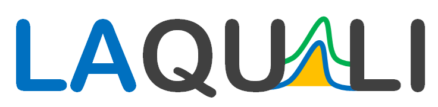

  

The [**Food Analysis Research Laboratory (LAQUALI)**](https://laquali-ufla.github.io/) is part of the Department of Food Science within the School of Agricultural Sciences at the [Federal University of Lavras (UFLA)](https://dri.ufla.br/), Brazil.

The laboratory is linked to the Research Group on Analytical Sciences Applied to Agri-food Products and is led by [Prof. Cleiton Nunes](https://sciprofiles.com/profile/2973549).

LAQUALI focuses on developing and applying innovative analytical methods to ensure the characterization, quality, authenticity, and safety of food, beverages, and agricultural products.

## Research Focus & Expertise

**Methodology & Analytical Tools**
* Spectroscopy, e-nose, sensors, and digital imaging
* Chemometrics and multivariate data analysis
* Portable, rapid, and green analytical methods
* Analytical method development and validation

**Applications & Target Areas**
* Food and beverage quality assessment
* Authenticity and fraud detection
* Agricultural product safety and characterization

LAQUALI develops **free** computational tools for chemometrics, experimental design, multivariate data analysis, and sensory evaluation.

## maRS

**maRS** is a software tool designed for multivariate analysis and chemometric data processing.

[Learn more about maRS →](https://laquali-ufla.github.io/mars/)

## DesignERS

**DesignERS** is a software tool for experimental design and process optimization.

[Learn more about DesignERS →](https://laquali-ufla.github.io/designers/)

## Chemoface

**Chemoface** is a software tool for chemometric analysis and experimental design.

[Learn more about Chemoface →](https://laquali-ufla.github.io/chemoface/)
